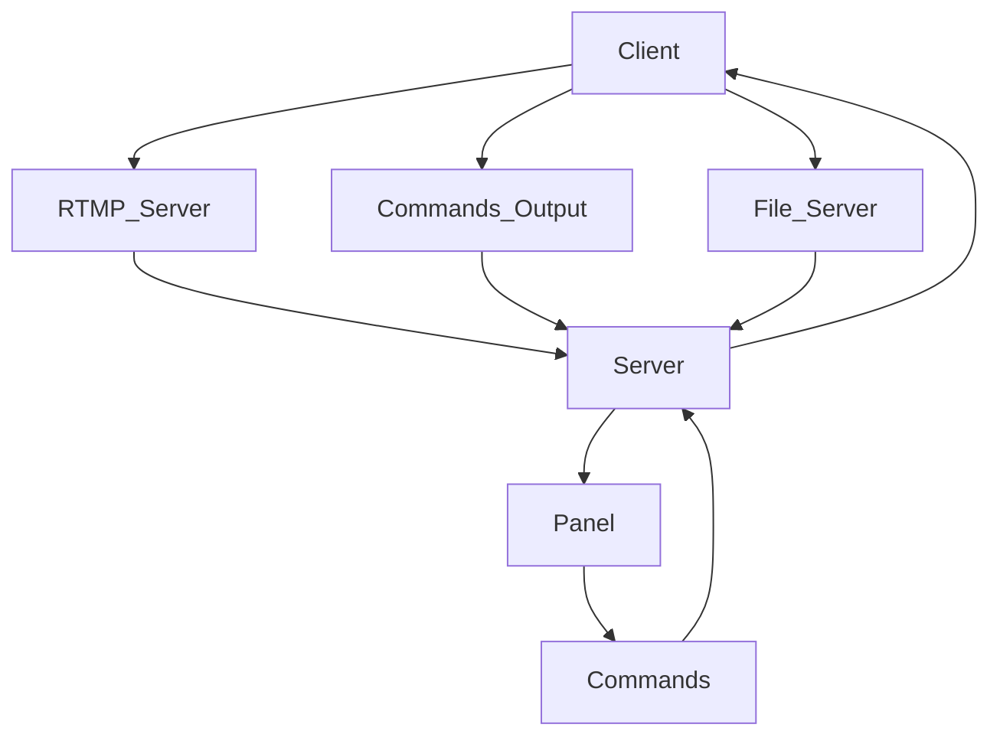

[WIP]

ℹ️Status: This is currently a concept. The repository contains test files.

**⚠️ Ethical Use & Disclaimer**
This software is developed for authorized administrative use only. Use of this tool for unauthorized access, cyberespionage, or any form of illegal activity is prohibited, illegal and may be punishable by law. The author assume no liability for misuse or damage caused by this software.

# Nyx
NYX. Remote access program for administration.

### How does this work?
> Clients (Clients connected to the server)

> Server (Central server. This is the heart of NYX.)

> Panel (Remote Administrator Access Tool)

#### Scheme:

